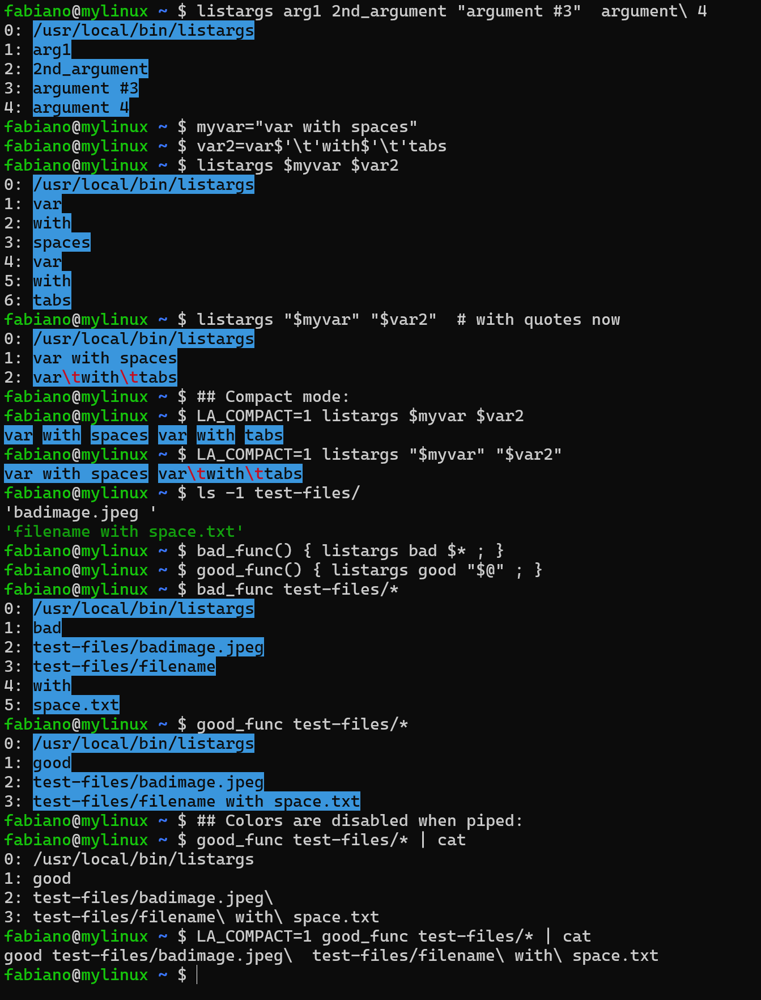

# listargs
Little helper command line tool that list arguments received in a easy to inspect way.


## Screenshots




## Install

Download:
```
curl -O 'https://raw.githubusercontent.com/fabianoengler/listargs/master/bin/listargs'
```

Set executable permission:
```
chmod +x listargs
```

Verify it's working:
```
./listargs "arg1" "arg with spaces" "
```

Optionally copy to your path:
```
sudo cp -v listargs /usr/local/bin
```


## Usage

Try these:
```
listargs "arg1" "arg with spaces" "two  spaces"
```
You should a nice colored output showing the exact arguments received
and how the arguments were split.

Listargs is also useful to see invisible characters like tabs and spaces in
the start and end of arguments:
```
listargs "arg with spaces" "two  spaces" and$'\t'tab "  startendspace  "
```

If you pipe it to a command, it should show escape characters instead
of colors:
```
listargs "arg with spaces" "two  spaces" and$'\t'tab "  startendspace  " | cat
```

Enable compact mode:
```
LA_COMPACT=1 listargs "two  spaces" with$'\t'tab "  start-end-space  "
```

Set compact mode for all subsequent commands:
```
export LA_COMPACT=1
listargs "arg1" "arg with spaces" "two  spaces"
listargs "three   spaces" with$'\t'tab "  start-end-space  "
listargs non-escaped      spaces    are ignored   by    shell
```

